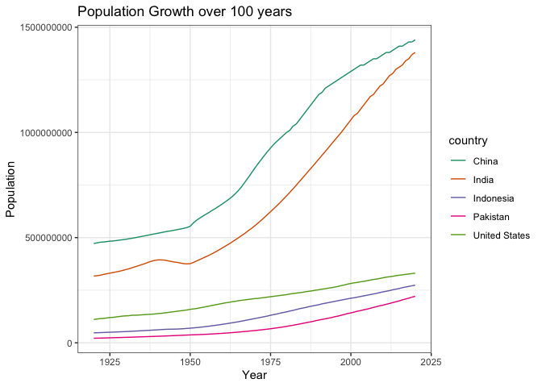
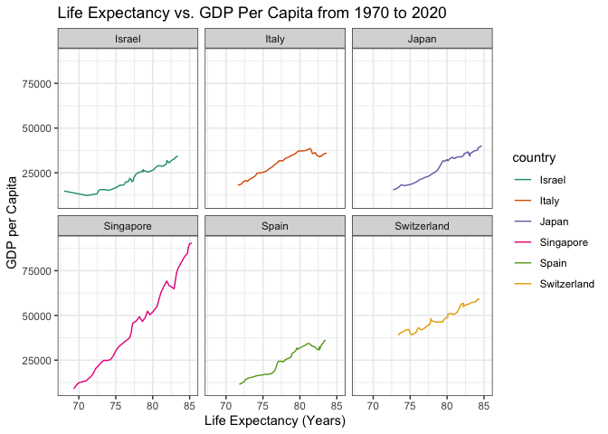

```r
library(tidyverse)
```

```
## ── Attaching packages ─────────────────────────────────────── tidyverse 1.3.1 ──
```

```
## ✓ ggplot2 3.3.5     ✓ purrr   0.3.4
## ✓ tibble  3.1.6     ✓ dplyr   1.0.7
## ✓ tidyr   1.1.4     ✓ stringr 1.4.0
## ✓ readr   2.1.1     ✓ forcats 0.5.1
```

```
## ── Conflicts ────────────────────────────────────────── tidyverse_conflicts() ──
## x dplyr::filter() masks stats::filter()
## x dplyr::lag()    masks stats::lag()
```

```r
library(janitor)
```

```
## 
## Attaching package: 'janitor'
```

```
## The following objects are masked from 'package:stats':
## 
##     chisq.test, fisher.test
```

```r
library(naniar)
```


```r
options(scipen=999)
```

## Instructions
Answer the following questions and complete the exercises in RMarkdown. Please embed all of your code and push your final work to your repository. Your code should be organized, clean, and run free from errors. Be sure to **add your name** to the author header above. You may use any resources to answer these questions (including each other), but you may not post questions to Open Stacks or external help sites. There are 10 total questions.  

Make sure to use the formatting conventions of RMarkdown to make your report neat and clean! Your plots should use consistent aesthetics throughout.  

This exam is due by **12:00p on Tuesday, February 22**.  

## Gapminder
For this assignment, we are going to use data from  [gapminder](https://www.gapminder.org/). Gapminder includes information about economics, population, social issues, and life expectancy from countries all over the world. We will use three data sets, so please load all three as separate objects.    

1. population_total.csv  

```r
population <- read.csv("data/population_total.csv") 
```


```r
names(population)
```


```r
glimpse(population)
```


2. income_per_person_gdppercapita_ppp_inflation_adjusted.csv  

```r
income_per_person <- read.csv("data/income_per_person_gdppercapita_ppp_inflation_adjusted.csv")
```


```r
names(income_per_person)
```


```r
glimpse(income_per_person)
```

3. life_expectancy_years.csv  

```r
life_expectancy <- read.csv("data/life_expectancy_years.csv")
```


```r
names(life_expectancy)
```


```r
glimpse(life_expectancy)
```

1. (3 points) Once you have an idea of the structure of the data, please make each data set tidy (hint: think back to pivots) and store them as new objects. You will need both the original (wide) and tidy (long) data!  

```r
population_long <-population %>% 
  pivot_longer(-country,
               names_to = "year",
               names_prefix = "X",
               values_to = "population")
population_long
```

```
## # A tibble: 58,695 × 3
##    country     year  population
##    <chr>       <chr>      <int>
##  1 Afghanistan 1800     3280000
##  2 Afghanistan 1801     3280000
##  3 Afghanistan 1802     3280000
##  4 Afghanistan 1803     3280000
##  5 Afghanistan 1804     3280000
##  6 Afghanistan 1805     3280000
##  7 Afghanistan 1806     3280000
##  8 Afghanistan 1807     3280000
##  9 Afghanistan 1808     3280000
## 10 Afghanistan 1809     3280000
## # … with 58,685 more rows
```

```r
life_expectancy_long <-life_expectancy %>% 
  pivot_longer(-country,
               names_to = "year",
               names_prefix = "X",
               values_to = "life_expectancy_years")
life_expectancy_long
```

```
## # A tibble: 56,287 × 3
##    country     year  life_expectancy_years
##    <chr>       <chr>                 <dbl>
##  1 Afghanistan 1800                   28.2
##  2 Afghanistan 1801                   28.2
##  3 Afghanistan 1802                   28.2
##  4 Afghanistan 1803                   28.2
##  5 Afghanistan 1804                   28.2
##  6 Afghanistan 1805                   28.2
##  7 Afghanistan 1806                   28.1
##  8 Afghanistan 1807                   28.1
##  9 Afghanistan 1808                   28.1
## 10 Afghanistan 1809                   28.1
## # … with 56,277 more rows
```


```r
income_per_person_long <- income_per_person %>% 
  pivot_longer(-country,
               names_to = "year",
               names_prefix = "X",
               values_to = "income_per_person")
income_per_person_long
```

```
## # A tibble: 46,513 × 3
##    country     year  income_per_person
##    <chr>       <chr>             <int>
##  1 Afghanistan 1800                603
##  2 Afghanistan 1801                603
##  3 Afghanistan 1802                603
##  4 Afghanistan 1803                603
##  5 Afghanistan 1804                603
##  6 Afghanistan 1805                603
##  7 Afghanistan 1806                603
##  8 Afghanistan 1807                603
##  9 Afghanistan 1808                603
## 10 Afghanistan 1809                603
## # … with 46,503 more rows
```

2. (1 point) How many different countries are represented in the data? Provide the total number and their names. Since each data set includes different numbers of countries, you will need to do this for each one.  

```r
#population data set
population %>% 
  summarize(countries=n_distinct(country))
```

```
##   countries
## 1       195
```

```r
population %>% 
  select(country)
```

```
##                            country
## 1                      Afghanistan
## 2                          Albania
## 3                          Algeria
## 4                          Andorra
## 5                           Angola
## 6              Antigua and Barbuda
## 7                        Argentina
## 8                          Armenia
## 9                        Australia
## 10                         Austria
## 11                      Azerbaijan
## 12                         Bahamas
## 13                         Bahrain
## 14                      Bangladesh
## 15                        Barbados
## 16                         Belarus
## 17                         Belgium
## 18                          Belize
## 19                           Benin
## 20                          Bhutan
## 21                         Bolivia
## 22          Bosnia and Herzegovina
## 23                        Botswana
## 24                          Brazil
## 25                          Brunei
## 26                        Bulgaria
## 27                    Burkina Faso
## 28                         Burundi
## 29                        Cambodia
## 30                        Cameroon
## 31                          Canada
## 32                      Cape Verde
## 33        Central African Republic
## 34                            Chad
## 35                           Chile
## 36                           China
## 37                        Colombia
## 38                         Comoros
## 39                Congo, Dem. Rep.
## 40                     Congo, Rep.
## 41                      Costa Rica
## 42                   Cote d'Ivoire
## 43                         Croatia
## 44                            Cuba
## 45                          Cyprus
## 46                  Czech Republic
## 47                         Denmark
## 48                        Djibouti
## 49                        Dominica
## 50              Dominican Republic
## 51                         Ecuador
## 52                           Egypt
## 53                     El Salvador
## 54               Equatorial Guinea
## 55                         Eritrea
## 56                         Estonia
## 57                        Eswatini
## 58                        Ethiopia
## 59                            Fiji
## 60                         Finland
## 61                          France
## 62                           Gabon
## 63                          Gambia
## 64                         Georgia
## 65                         Germany
## 66                           Ghana
## 67                          Greece
## 68                         Grenada
## 69                       Guatemala
## 70                          Guinea
## 71                   Guinea-Bissau
## 72                          Guyana
## 73                           Haiti
## 74                        Holy See
## 75                        Honduras
## 76                         Hungary
## 77                         Iceland
## 78                           India
## 79                       Indonesia
## 80                            Iran
## 81                            Iraq
## 82                         Ireland
## 83                          Israel
## 84                           Italy
## 85                         Jamaica
## 86                           Japan
## 87                          Jordan
## 88                      Kazakhstan
## 89                           Kenya
## 90                        Kiribati
## 91                          Kuwait
## 92                 Kyrgyz Republic
## 93                             Lao
## 94                          Latvia
## 95                         Lebanon
## 96                         Lesotho
## 97                         Liberia
## 98                           Libya
## 99                   Liechtenstein
## 100                      Lithuania
## 101                     Luxembourg
## 102                     Madagascar
## 103                         Malawi
## 104                       Malaysia
## 105                       Maldives
## 106                           Mali
## 107                          Malta
## 108               Marshall Islands
## 109                     Mauritania
## 110                      Mauritius
## 111                         Mexico
## 112          Micronesia, Fed. Sts.
## 113                        Moldova
## 114                         Monaco
## 115                       Mongolia
## 116                     Montenegro
## 117                        Morocco
## 118                     Mozambique
## 119                        Myanmar
## 120                        Namibia
## 121                          Nauru
## 122                          Nepal
## 123                    Netherlands
## 124                    New Zealand
## 125                      Nicaragua
## 126                          Niger
## 127                        Nigeria
## 128                    North Korea
## 129                North Macedonia
## 130                         Norway
## 131                           Oman
## 132                       Pakistan
## 133                          Palau
## 134                      Palestine
## 135                         Panama
## 136               Papua New Guinea
## 137                       Paraguay
## 138                           Peru
## 139                    Philippines
## 140                         Poland
## 141                       Portugal
## 142                          Qatar
## 143                        Romania
## 144                         Russia
## 145                         Rwanda
## 146                          Samoa
## 147                     San Marino
## 148          Sao Tome and Principe
## 149                   Saudi Arabia
## 150                        Senegal
## 151                         Serbia
## 152                     Seychelles
## 153                   Sierra Leone
## 154                      Singapore
## 155                Slovak Republic
## 156                       Slovenia
## 157                Solomon Islands
## 158                        Somalia
## 159                   South Africa
## 160                    South Korea
## 161                    South Sudan
## 162                          Spain
## 163                      Sri Lanka
## 164            St. Kitts and Nevis
## 165                      St. Lucia
## 166 St. Vincent and the Grenadines
## 167                          Sudan
## 168                       Suriname
## 169                         Sweden
## 170                    Switzerland
## 171                          Syria
## 172                     Tajikistan
## 173                       Tanzania
## 174                       Thailand
## 175                    Timor-Leste
## 176                           Togo
## 177                          Tonga
## 178            Trinidad and Tobago
## 179                        Tunisia
## 180                         Turkey
## 181                   Turkmenistan
## 182                         Tuvalu
## 183                         Uganda
## 184                        Ukraine
## 185           United Arab Emirates
## 186                 United Kingdom
## 187                  United States
## 188                        Uruguay
## 189                     Uzbekistan
## 190                        Vanuatu
## 191                      Venezuela
## 192                        Vietnam
## 193                          Yemen
## 194                         Zambia
## 195                       Zimbabwe
```

```r
#income_per_person data set
income_per_person %>% 
  summarize(n_distinct(country))
```

```
##   n_distinct(country)
## 1                 193
```

```r
income_per_person %>% 
  select(country)
```

```
##                            country
## 1                      Afghanistan
## 2                          Albania
## 3                          Algeria
## 4                          Andorra
## 5                           Angola
## 6              Antigua and Barbuda
## 7                        Argentina
## 8                          Armenia
## 9                        Australia
## 10                         Austria
## 11                      Azerbaijan
## 12                         Bahamas
## 13                         Bahrain
## 14                      Bangladesh
## 15                        Barbados
## 16                         Belarus
## 17                         Belgium
## 18                          Belize
## 19                           Benin
## 20                          Bhutan
## 21                         Bolivia
## 22          Bosnia and Herzegovina
## 23                        Botswana
## 24                          Brazil
## 25                          Brunei
## 26                        Bulgaria
## 27                    Burkina Faso
## 28                         Burundi
## 29                        Cambodia
## 30                        Cameroon
## 31                          Canada
## 32                      Cape Verde
## 33        Central African Republic
## 34                            Chad
## 35                           Chile
## 36                           China
## 37                        Colombia
## 38                         Comoros
## 39                Congo, Dem. Rep.
## 40                     Congo, Rep.
## 41                      Costa Rica
## 42                   Cote d'Ivoire
## 43                         Croatia
## 44                            Cuba
## 45                          Cyprus
## 46                  Czech Republic
## 47                         Denmark
## 48                        Djibouti
## 49                        Dominica
## 50              Dominican Republic
## 51                         Ecuador
## 52                           Egypt
## 53                     El Salvador
## 54               Equatorial Guinea
## 55                         Eritrea
## 56                         Estonia
## 57                        Eswatini
## 58                        Ethiopia
## 59                            Fiji
## 60                         Finland
## 61                          France
## 62                           Gabon
## 63                          Gambia
## 64                         Georgia
## 65                         Germany
## 66                           Ghana
## 67                          Greece
## 68                         Grenada
## 69                       Guatemala
## 70                          Guinea
## 71                   Guinea-Bissau
## 72                          Guyana
## 73                           Haiti
## 74                        Honduras
## 75                         Hungary
## 76                         Iceland
## 77                           India
## 78                       Indonesia
## 79                            Iran
## 80                            Iraq
## 81                         Ireland
## 82                          Israel
## 83                           Italy
## 84                         Jamaica
## 85                           Japan
## 86                          Jordan
## 87                      Kazakhstan
## 88                           Kenya
## 89                        Kiribati
## 90                          Kuwait
## 91                 Kyrgyz Republic
## 92                             Lao
## 93                          Latvia
## 94                         Lebanon
## 95                         Lesotho
## 96                         Liberia
## 97                           Libya
## 98                       Lithuania
## 99                      Luxembourg
## 100                     Madagascar
## 101                         Malawi
## 102                       Malaysia
## 103                       Maldives
## 104                           Mali
## 105                          Malta
## 106               Marshall Islands
## 107                     Mauritania
## 108                      Mauritius
## 109                         Mexico
## 110          Micronesia, Fed. Sts.
## 111                        Moldova
## 112                         Monaco
## 113                       Mongolia
## 114                     Montenegro
## 115                        Morocco
## 116                     Mozambique
## 117                        Myanmar
## 118                        Namibia
## 119                          Nauru
## 120                          Nepal
## 121                    Netherlands
## 122                    New Zealand
## 123                      Nicaragua
## 124                          Niger
## 125                        Nigeria
## 126                    North Korea
## 127                North Macedonia
## 128                         Norway
## 129                           Oman
## 130                       Pakistan
## 131                          Palau
## 132                      Palestine
## 133                         Panama
## 134               Papua New Guinea
## 135                       Paraguay
## 136                           Peru
## 137                    Philippines
## 138                         Poland
## 139                       Portugal
## 140                          Qatar
## 141                        Romania
## 142                         Russia
## 143                         Rwanda
## 144                          Samoa
## 145                     San Marino
## 146          Sao Tome and Principe
## 147                   Saudi Arabia
## 148                        Senegal
## 149                         Serbia
## 150                     Seychelles
## 151                   Sierra Leone
## 152                      Singapore
## 153                Slovak Republic
## 154                       Slovenia
## 155                Solomon Islands
## 156                        Somalia
## 157                   South Africa
## 158                    South Korea
## 159                    South Sudan
## 160                          Spain
## 161                      Sri Lanka
## 162            St. Kitts and Nevis
## 163                      St. Lucia
## 164 St. Vincent and the Grenadines
## 165                          Sudan
## 166                       Suriname
## 167                         Sweden
## 168                    Switzerland
## 169                          Syria
## 170                     Tajikistan
## 171                       Tanzania
## 172                       Thailand
## 173                    Timor-Leste
## 174                           Togo
## 175                          Tonga
## 176            Trinidad and Tobago
## 177                        Tunisia
## 178                         Turkey
## 179                   Turkmenistan
## 180                         Tuvalu
## 181                         Uganda
## 182                        Ukraine
## 183           United Arab Emirates
## 184                 United Kingdom
## 185                  United States
## 186                        Uruguay
## 187                     Uzbekistan
## 188                        Vanuatu
## 189                      Venezuela
## 190                        Vietnam
## 191                          Yemen
## 192                         Zambia
## 193                       Zimbabwe
```

```r
#life_expectancy data set
life_expectancy %>% 
  summarize(n_distinct(country))
```

```
##   n_distinct(country)
## 1                 187
```

```r
life_expectancy %>% 
  select(country)
```

```
##                            country
## 1                      Afghanistan
## 2                          Albania
## 3                          Algeria
## 4                          Andorra
## 5                           Angola
## 6              Antigua and Barbuda
## 7                        Argentina
## 8                          Armenia
## 9                        Australia
## 10                         Austria
## 11                      Azerbaijan
## 12                         Bahamas
## 13                         Bahrain
## 14                      Bangladesh
## 15                        Barbados
## 16                         Belarus
## 17                         Belgium
## 18                          Belize
## 19                           Benin
## 20                          Bhutan
## 21                         Bolivia
## 22          Bosnia and Herzegovina
## 23                        Botswana
## 24                          Brazil
## 25                          Brunei
## 26                        Bulgaria
## 27                    Burkina Faso
## 28                         Burundi
## 29                        Cambodia
## 30                        Cameroon
## 31                          Canada
## 32                      Cape Verde
## 33        Central African Republic
## 34                            Chad
## 35                           Chile
## 36                           China
## 37                        Colombia
## 38                         Comoros
## 39                Congo, Dem. Rep.
## 40                     Congo, Rep.
## 41                      Costa Rica
## 42                   Cote d'Ivoire
## 43                         Croatia
## 44                            Cuba
## 45                          Cyprus
## 46                  Czech Republic
## 47                         Denmark
## 48                        Djibouti
## 49                        Dominica
## 50              Dominican Republic
## 51                         Ecuador
## 52                           Egypt
## 53                     El Salvador
## 54               Equatorial Guinea
## 55                         Eritrea
## 56                         Estonia
## 57                        Eswatini
## 58                        Ethiopia
## 59                            Fiji
## 60                         Finland
## 61                          France
## 62                           Gabon
## 63                          Gambia
## 64                         Georgia
## 65                         Germany
## 66                           Ghana
## 67                          Greece
## 68                         Grenada
## 69                       Guatemala
## 70                          Guinea
## 71                   Guinea-Bissau
## 72                          Guyana
## 73                           Haiti
## 74                        Honduras
## 75                         Hungary
## 76                         Iceland
## 77                           India
## 78                       Indonesia
## 79                            Iran
## 80                            Iraq
## 81                         Ireland
## 82                          Israel
## 83                           Italy
## 84                         Jamaica
## 85                           Japan
## 86                          Jordan
## 87                      Kazakhstan
## 88                           Kenya
## 89                        Kiribati
## 90                          Kuwait
## 91                 Kyrgyz Republic
## 92                             Lao
## 93                          Latvia
## 94                         Lebanon
## 95                         Lesotho
## 96                         Liberia
## 97                           Libya
## 98                       Lithuania
## 99                      Luxembourg
## 100                     Madagascar
## 101                         Malawi
## 102                       Malaysia
## 103                       Maldives
## 104                           Mali
## 105                          Malta
## 106               Marshall Islands
## 107                     Mauritania
## 108                      Mauritius
## 109                         Mexico
## 110          Micronesia, Fed. Sts.
## 111                        Moldova
## 112                       Mongolia
## 113                     Montenegro
## 114                        Morocco
## 115                     Mozambique
## 116                        Myanmar
## 117                        Namibia
## 118                          Nepal
## 119                    Netherlands
## 120                    New Zealand
## 121                      Nicaragua
## 122                          Niger
## 123                        Nigeria
## 124                    North Korea
## 125                North Macedonia
## 126                         Norway
## 127                           Oman
## 128                       Pakistan
## 129                      Palestine
## 130                         Panama
## 131               Papua New Guinea
## 132                       Paraguay
## 133                           Peru
## 134                    Philippines
## 135                         Poland
## 136                       Portugal
## 137                          Qatar
## 138                        Romania
## 139                         Russia
## 140                         Rwanda
## 141                          Samoa
## 142          Sao Tome and Principe
## 143                   Saudi Arabia
## 144                        Senegal
## 145                         Serbia
## 146                     Seychelles
## 147                   Sierra Leone
## 148                      Singapore
## 149                Slovak Republic
## 150                       Slovenia
## 151                Solomon Islands
## 152                        Somalia
## 153                   South Africa
## 154                    South Korea
## 155                    South Sudan
## 156                          Spain
## 157                      Sri Lanka
## 158                      St. Lucia
## 159 St. Vincent and the Grenadines
## 160                          Sudan
## 161                       Suriname
## 162                         Sweden
## 163                    Switzerland
## 164                          Syria
## 165                     Tajikistan
## 166                       Tanzania
## 167                       Thailand
## 168                    Timor-Leste
## 169                           Togo
## 170                          Tonga
## 171            Trinidad and Tobago
## 172                        Tunisia
## 173                         Turkey
## 174                   Turkmenistan
## 175                         Uganda
## 176                        Ukraine
## 177           United Arab Emirates
## 178                 United Kingdom
## 179                  United States
## 180                        Uruguay
## 181                     Uzbekistan
## 182                        Vanuatu
## 183                      Venezuela
## 184                        Vietnam
## 185                          Yemen
## 186                         Zambia
## 187                       Zimbabwe
```

## Life Expectancy  

3. (2 points) Let's limit the data to 100 years (1920-2020). For these years, which country has the highest average life expectancy? How about the lowest average life expectancy?  

```r
life_expectancy_long %>% 
  filter(year>=1920 & year<=2020) %>% 
  group_by(country) %>% 
  summarize(mean_life_expectancy=mean(life_expectancy_years, na.rm=T)) %>% 
  arrange(desc(mean_life_expectancy))
```

```
## # A tibble: 187 × 2
##    country     mean_life_expectancy
##    <chr>                      <dbl>
##  1 Andorra                     79.8
##  2 Sweden                      73.5
##  3 Norway                      73.2
##  4 Netherlands                 73.0
##  5 Dominica                    73.0
##  6 Iceland                     72.9
##  7 Australia                   72.7
##  8 Switzerland                 72.7
##  9 Denmark                     71.9
## 10 Canada                      71.8
## # … with 177 more rows
```
Andorra has the highest average life expectancy between 1920-2020. Central African Republic has the lowest average life expectancy during the same time period. 

4. (3 points) Although we can see which country has the highest life expectancy for the past 100 years, we don't know which countries have changed the most. What are the top 5 countries that have experienced the biggest improvement in life expectancy between 1920-2020?  

```r
life_expectancy %>% 
  mutate(change_life_expectancy=X2020-X1920) %>% 
  select(country, X1920, X2020, change_life_expectancy) %>% 
  arrange(desc(change_life_expectancy)) %>% 
  top_n(5)
```

```
## Selecting by change_life_expectancy
```

```
##           country X1920 X2020 change_life_expectancy
## 1          Kuwait  26.6  83.4                   56.8
## 2 Kyrgyz Republic  16.6  73.1                   56.5
## 3    Turkmenistan  15.2  70.5                   55.3
## 4     South Korea  28.2  83.2                   55.0
## 5      Tajikistan  16.7  71.0                   54.3
```

5. (3 points) Make a plot that shows the change over the past 100 years for the country with the biggest improvement in life expectancy. Be sure to add appropriate aesthetics to make the plot clean and clear. Once you have made the plot, do a little internet searching and see if you can discover what historical event may have contributed to this remarkable change.  

```r
life_expectancy_long %>% 
  filter(country=="Kuwait") %>% 
  filter(year>=1920 & year<=2020) %>% 
  ggplot(aes(x=as.integer(year), y=life_expectancy_years)) +
  geom_line() +
  labs(title = "Life Expectancy in Kuwait over 100 years",
       x="Year",
       y="Life Expectancy (Years)")+
  theme_bw()
```

<!-- -->

## Population Growth
6. (3 points) Which 5 countries have had the highest population growth over the past 100 years (1920-2020)?  

```r
population %>% 
  mutate(pop_growth=X2020-X1920) %>% 
  select(country, X1920, X2020, pop_growth) %>% 
  arrange(desc(pop_growth)) %>% 
  top_n(5)
```

```
## Selecting by pop_growth
```

```
##         country     X1920      X2020 pop_growth
## 1         India 317000000 1380000000 1063000000
## 2         China 472000000 1440000000  968000000
## 3     Indonesia  47300000  274000000  226700000
## 4 United States 111000000  331000000  220000000
## 5      Pakistan  21700000  221000000  199300000
```

7. (4 points) Produce a plot that shows the 5 countries that have had the highest population growth over the past 100 years (1920-2020). Which countries appear to have had exponential growth?  

```r
population_long %>% 
  filter(country=="India" | country=="China" | country=="Indonesia" | country=="United States" | country=="Pakistan") %>%
  filter(year>=1920 & year<=2020) %>% 
  ggplot(aes(x=as.integer(year), y=population, color=country))+
  geom_line()+
  labs(title = "Population Growth over 100 years",
       x="Year",
       y="Population")+
  theme_bw()+
  scale_color_brewer(palette="Dark2")
```

<!-- -->
China and India appear to have exponential growth. 

## Income
The units used for income are gross domestic product per person adjusted for differences in purchasing power in international dollars.

8. (4 points) As in the previous questions, which countries have experienced the biggest growth in per person GDP. Show this as a table and then plot the changes for the top 5 countries. With a bit of research, you should be able to explain the dramatic downturns of the wealthiest economies that occurred during the 1980's.  

```r
#asking you to compare change in GDP between countries 
#one possible interpretation is GDP at end year and GDP at start and you do a subtraction, but this doesn't account for good and bad years
income_per_person %>% 
  mutate(change_gdp=X2020-X1920) %>% 
  select(country, X1920, X2020, change_gdp) %>% 
  arrange(desc(change_gdp)) %>% 
  top_n(5)
```

```
## Selecting by change_gdp
```

```
##      country X1920  X2020 change_gdp
## 1      Qatar  2300 116000     113700
## 2 Luxembourg  5730  95100      89370
## 3  Singapore  2440  90500      88060
## 4     Brunei  2130  75100      72970
## 5    Ireland  5170  74100      68930
```

```r
income_per_person_long %>% 
  filter(country=="Qatar" | country=="Luxembourg" | country=="Singapore" | country=="Brunei" | country=="Ireland") %>% 
  filter(year>=1920 & year<=2020) %>% 
  ggplot(aes(x=as.integer(year), y=income_per_person, color=country))+
  geom_line()+
  facet_wrap(~country)+
  theme_bw()+
  theme(axis.text.x=element_text(angle=60, hjust=1))+
  labs(title = "GDP Per Capita Change Over 100 Years",
       x="Year",
       y="GDP per Capita")+
  scale_color_brewer(palette="Dark2")
```

<!-- -->

9. (3 points) Create three new objects that restrict each data set (life expectancy, population, income) to the years 1920-2020. Hint: I suggest doing this with the long form of your data. Once this is done, merge all three data sets using the code I provide below. You may need to adjust the code depending on how you have named your objects. I called mine `life_expectancy_100`, `population_100`, and `income_100`. For some of you, learning these `joins` will be important for your project. 


```r
life_expectancy_100 <- life_expectancy_long %>% 
  filter(year>=1920 & year<=2020)
```


```r
population_100 <- population_long %>% 
  filter(year>=1920 & year<=2020)
```


```r
income_100 <- income_per_person_long %>% 
  filter(year>=1920 & year<=2020)
```


```r
gapminder_join <- inner_join(life_expectancy_100, population_100, by= c("country", "year"))
gapminder_join <- inner_join(gapminder_join, income_100, by= c("country", "year"))
gapminder_join
```

```
## # A tibble: 18,887 × 5
##    country     year  life_expectancy_years population income_per_person
##    <chr>       <chr>                 <dbl>      <int>             <int>
##  1 Afghanistan 1920                   30.6   10600000              1490
##  2 Afghanistan 1921                   30.7   10500000              1520
##  3 Afghanistan 1922                   30.8   10300000              1550
##  4 Afghanistan 1923                   30.8    9710000              1570
##  5 Afghanistan 1924                   30.9    9200000              1600
##  6 Afghanistan 1925                   31      8720000              1630
##  7 Afghanistan 1926                   31      8260000              1650
##  8 Afghanistan 1927                   31.1    7830000              1680
##  9 Afghanistan 1928                   31.1    7420000              1710
## 10 Afghanistan 1929                   31.2    7100000              1740
## # … with 18,877 more rows
```

10. (4 points) Use the joined data to perform an analysis of your choice. The analysis should include a comparison between two or more of the variables `life_expectancy`, `population`, or `income.`  

```r
gapminder_join %>% 
  filter(year==2020) %>% 
  group_by(country) %>% 
  summarize(mean_life_exp=mean(life_expectancy_years, na.rm=T)) %>% 
  arrange(desc(mean_life_exp)) 
```

```
## # A tibble: 187 × 2
##    country     mean_life_exp
##    <chr>               <dbl>
##  1 Singapore            85.3
##  2 Japan                84.7
##  3 Switzerland          84.4
##  4 Italy                83.6
##  5 Spain                83.5
##  6 Israel               83.4
##  7 Kuwait               83.4
##  8 France               83.2
##  9 Iceland              83.2
## 10 South Korea          83.2
## # … with 177 more rows
```

```r
#Countries with top life expectancy in 2020: Singapore, Japan, Switzerland, Italy, Spain, Israel
```


```r
gapminder_join %>% 
  filter(year>=1970 & year<=2020) %>% 
  filter(country=="Israel" | country=="Singapore" | country== "Japan" | country == "Switzerland" | country=="Italy" | country== "Spain") %>% 
  ggplot(aes(x=life_expectancy_years, y=income_per_person, color=country))+
  geom_line()+
  facet_wrap(~country)+
  theme_bw()+
  labs(title = "Life Expectancy vs. GDP Per Capita from 1970 to 2020",
       x="Life Expectancy (Years)",
       y="GDP per Capita")+
  scale_color_brewer(palette="Dark2")
```

<!-- -->

